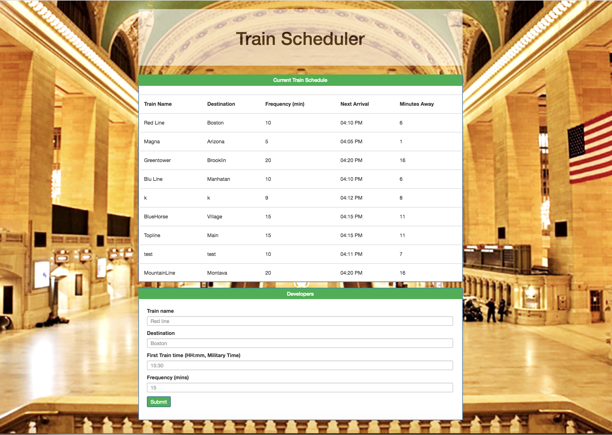

# Train-Scheduler

## Overview

*Train-Scheduler, is an application that helps users to locate a train, its destination, the time it will arrive, and how frenquent will stop at the station.

## Technologies implemented

*HTML, CSS, Bootstrap, Javascript.

## Author

**Reyna Perez**

## Acknowledgments

*UA Programing Bootcamp